# Using Diffusion Models for Sparse 3D Gaussian Splatting (3DGS)

## Introduction

3D Gaussian Splatting [(Kerbl et. al.)](https://arxiv.org/abs/2308.04079) has quickly become a leading approach for real-time rendering by representing scenes as collections of anisotropic Gaussians with learnable geometric and appearance attributes, enabling high-quality view synthesis without the heavy volumetric integration required by implicit radiance fields [(Mildenhall et. al.)](https://arxiv.org/abs/2003.08934). However, despite its efficiency and strong performance under dense, well-covered input views, the method faces significant challenges when applied to a set of sparse input views common in mobile captures from the average user. With limited viewpoints, photometric and geometric cues become insufficiently constrained, leading to depth ambiguities, unstable optimization, floating artifacts, and overfitting to the few available views. These issues highlight an important gap between controlled experimental conditions and real-world data acquisition, motivating ongoing research into structural priors, depth cues, and hybrid representations that aim to make Gaussian Splatting more robust and reliable under sparse input.

## What We Accomplished

Our team thought of many approaches on improving the quality of rendered views despite having having sparse input views. These approaches include making API calls to Nano Banana Pro to clean up badly-rendered 3DGS views, ...

## Approach 1: Cleaning Badly-Rendered 3DGS Views with Nano Banana Pro

### Prerequisites
* Have a Gemini API key
* Create a Conda environment and then install [Pytorch](https://pytorch.org/get-started/locally/)

### Setting up Conda environment
```
cd pipeline
pip install -r requirements.txt
pip install gsplat
conda install conda-forge::colmap
```

### Pipeline details

This approach is implemented in the pipeline subdirectory of this repository, and it focuses on improving the render quality of NerfStudio's 3DGS model [Gsplat](https://github.com/nerfstudio-project/gsplat) when given a sparse set of views. To improve the render quality of the Gsplat model when trained on a sparse set of images, we first filter out geometrically inconsistent views through [Colmap's](https://colmap.github.io/) sparse reconstruction. We then train the model for 30 thousand iterations before freezing it. We then use the frozen model to render a mp4 video of the captured scene that takes on an ellipsoidal camera path trajectory. The mp4 video is then split into individual frames and each frame is cleaned using 2 API calls to [Nano Banana Pro](https://ai.google.dev/gemini-api/docs/image-generation). The first API call creates a colored depth map of the frame. The second API call then uses a downsampled version of the original frame together with the previously generated colored depth map to reconstruct a clean, distortion-free frame. The cleaned frames are then resized and concatenated to the sparse set of views, and the whole process is repeated another two times. 

### Dataset used for testing
We tested this approach on both 15% and 25% of the images (randomly sampled) within the bicycle dataset of Mip-NeRF 360. 

You can download this dataset with the following command:
```
python pipeline/datasets/download_dataset.py
```
You can then simulate a sparse dataset by doing the following:
```
python pipeline/datasets/sparse_dataset.py --input-path <path to images directory> --output-path <output directory> --sample-ratio <0-1 exclusive>
```

### Nano Banana Pro Results

Most 3DGS rendered frames for a model trained on just 25% of the original bicycle dataset were successfully cleaned and reconstructed by Nano Banana Pro as shown below for frame 16 under the /results_nano_banana_bikesparse48 directory.

3DGS Rendered Frame 16             |  Downsampled          |Colored Depth Map             |  Cleaned Frame 16
:-------------------------:|:-------------------------:|:-------------------------:|:-------------------------:
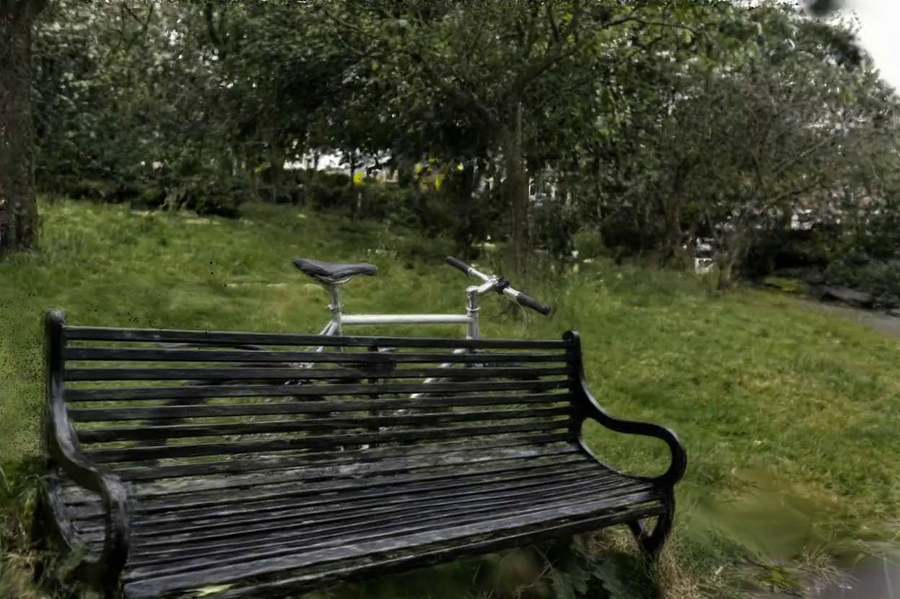   |  | 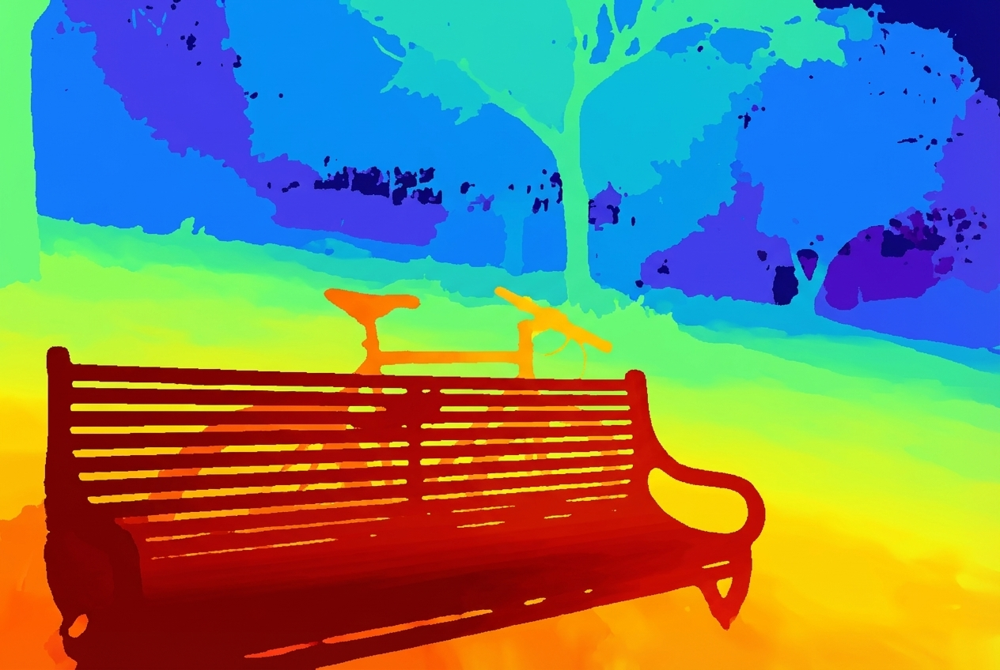  |  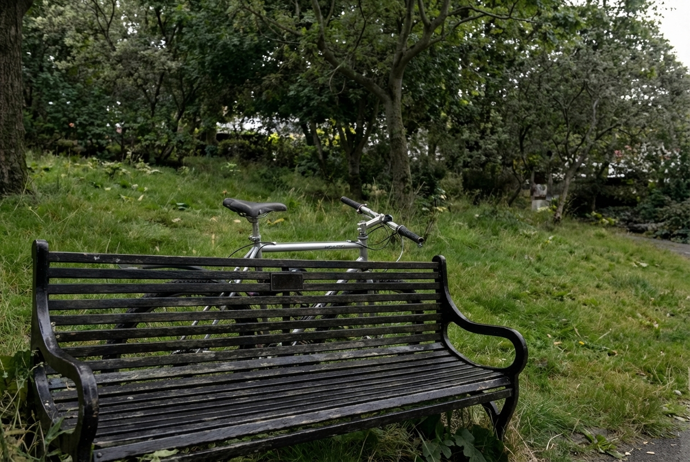

However some reconstructed frames had clear hallucinations, usually in the background, as shown below in frame 4 under the /results_nano_banana_bikesparse48 directory.
3DGS Rendered Frame 4             |  Downsampled          |Colored Depth Map             |  Cleaned Frame 4
:-------------------------:|:-------------------------:|:-------------------------:|:-------------------------:
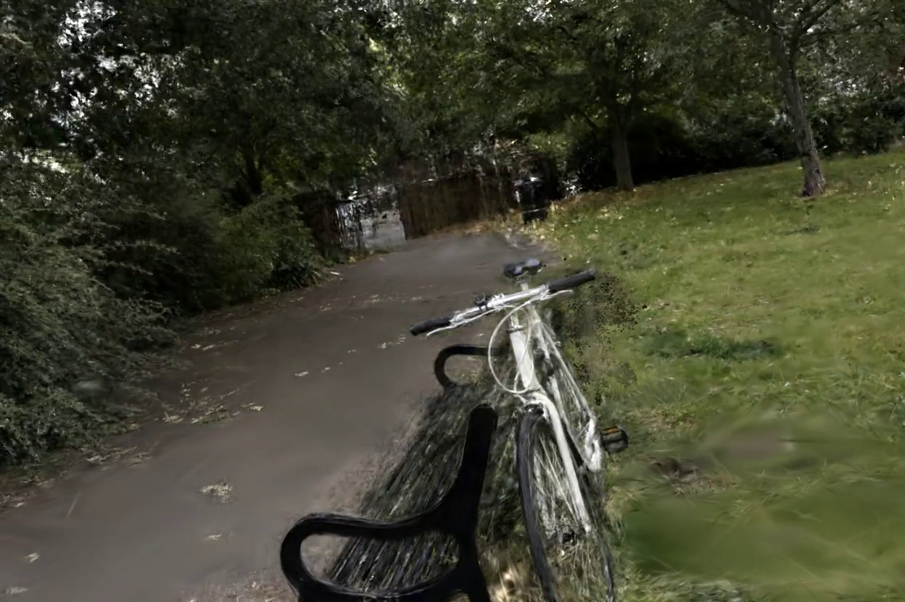   | 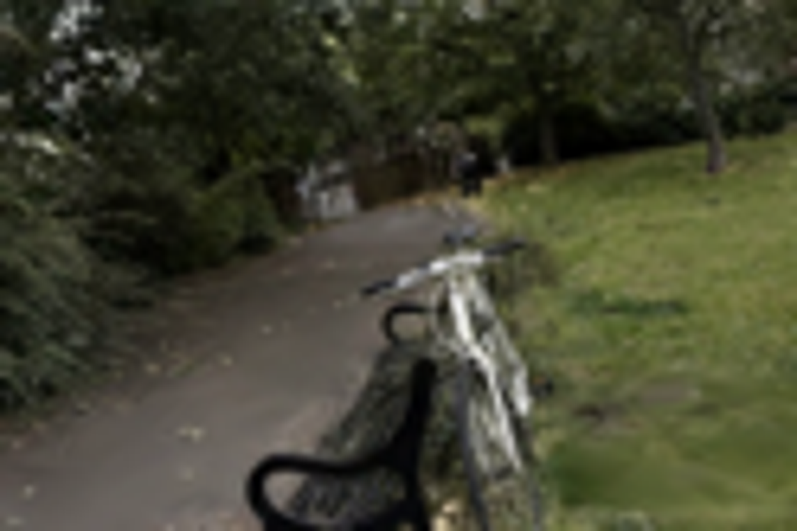 | 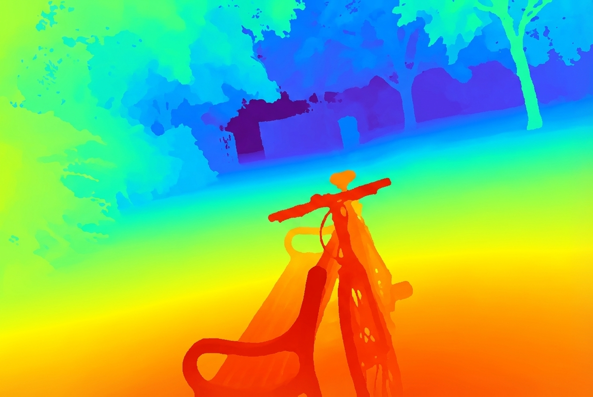  |  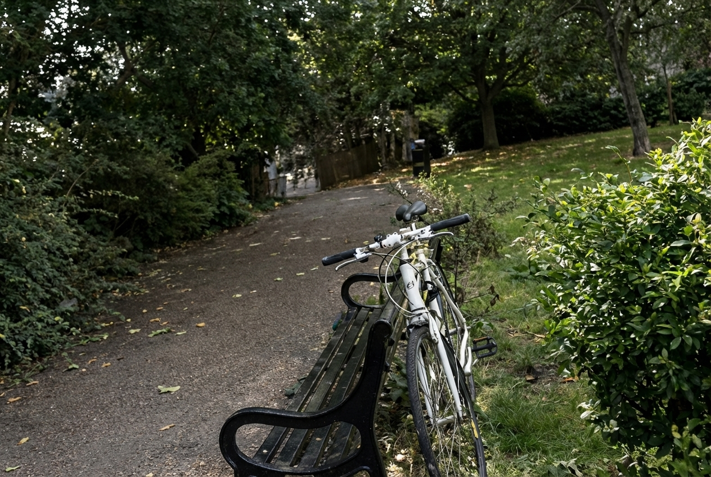

Nano Banana Pro performed significantly worse on just 15% of the original bicycle dataset. We hypothesize this is due to the poor quality of the 3DGS renders. It is likely that Nano Banana Pro could not determine what was captured in the 3DGS rendered frames, so it hallucinated entirely different scenes. After the third iteration of our pipeline, all 3DGS frames were heavily distorted by the accumulated hallucinations. We show the Nano Banana Pro results for frame 14 under the /results_nano_banana_bikesparse29 directory as an example below.

3DGS Rendered Frame 14             |  Downsampled          |Colored Depth Map             |  Cleaned Frame 14
:-------------------------:|:-------------------------:|:-------------------------:|:-------------------------:
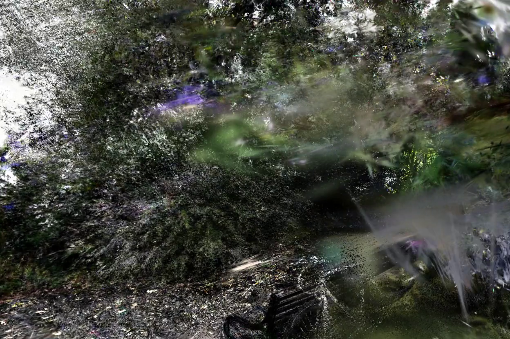   | 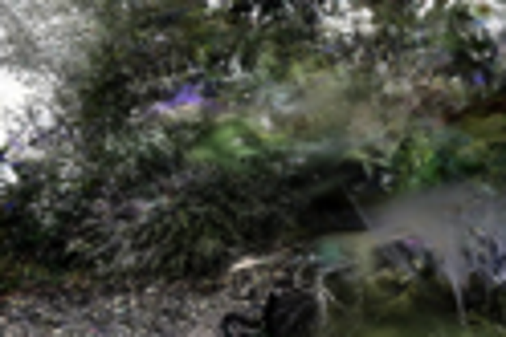 | 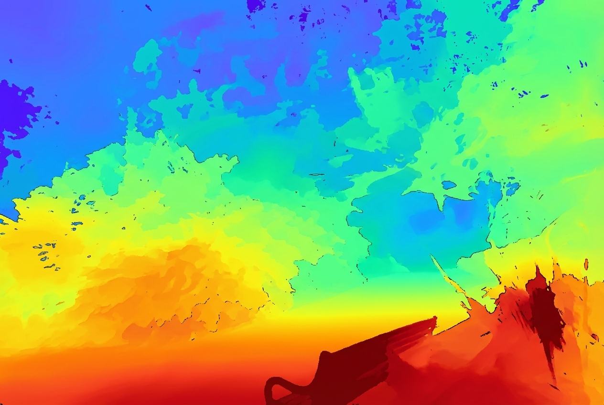  |  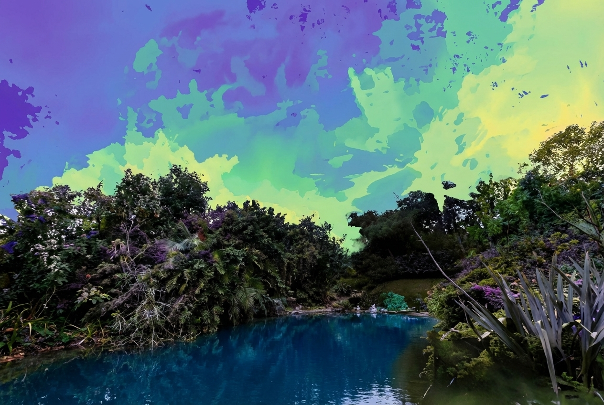

### Overall Results
This approach performed worse on all benchmarks when compared to just using 3DGS. We think this is due to the accumulated hallucinations introduced in the background of the 3DGS rendered frames as well as geometric inconsistencies that were not pruned by Colmap.

#### 25% of bicycle dataset from Mip-NeRF 360:
| Implementation | PSNR  | SSIM | LPIPS |
|----------------|-------|------|-------|
|    baseline    | 16.98 | 0.44 | 0.38  |
|      ours      | 16.76 | 0.35 | 0.41  |

#### 15% of bicycle dataset from Mip-NeRF 360:
| Implementation | PSNR  | SSIM | LPIPS |
|----------------|-------|------|-------|
|    baseline    | 12.72 | 0.31 | 0.52  |
|      ours      | 12.15 | 0.17 | 0.61  |

### Proposed Further Improvements
* Pass in all 3DGS rendered frames and original input simultaneously to a video diffusion model to get structural priors
* Add an additional filtering pipeline to remove cleaned frames that are geometrically inconsistent with the input

### Training your own sparse set of images using this approach
1. Make a directory for you input named input/images and place your images in that directory.
    ```
    cd pipeline
    mkdir -p input/images
    ```
2. Activate your conda environment from following steps in [prerequisite](#prerequisite) and [setup](#setting-up-conda-environment).
3. Run the pipeline!
    ```
    bash pipeline.sh
    ```
### Files created for this approach
* pipeline/datasets/sparse_dataset.py
* pipeline/api_call.py
* pipeline/resize_images.py
* pipeline/resize_input.py
* pipeline/pipeline.sh

## Approach 2: Post-processing 3DGS Renders with Qwen
### Prerequisites
* [ComfyUI](https://github.com/comfyanonymous/ComfyUI)
* [Qwen Image Edit 2509](https://huggingface.co/Qwen) and its required custom nodes
* Python 3.9 or newer
* [FFmpeg](https://ffmpeg.org/)

### How to Use This Approach

This approach does not provide a single end-to-end automated pipeline.
Instead, it combines an interactive ComfyUI workflow for Qwen-based image editing
with a set of standalone Python scripts that handle preprocessing, camera
transform conversion, and quantitative evaluation.

This design reflects the practical usage pattern of diffusion-based image editing
in ComfyUI, while still ensuring that all experimental steps are reproducible.

All auxiliary scripts used in this approach are located under
[`./qwen-image-edit/scripts/`](./qwen-image-edit/scripts/).

### Typical Workflow

A typical usage flow for this approach is as follows:

1. Render views from a trained sparse 3DGS model using Nerfstudio.
2. (Optional) Convert between `transforms.json` and `ns-viewer` camera-path formats
   to generate or reuse specific camera trajectories.
3. Preprocess rendered frames using the provided preprocessing scripts.
4. Load the provided ComfyUI workflow and apply Qwen Image Edit to the rendered frames.
5. Postprocess and resize the edited images if needed.
6. Run `2dcpr.py` to compare:
   - Test images vs original 3DGS renders
   - Test images vs Qwen-augmented 3DGS renders
   - Original 3DGS renders vs Qwen-edited renders
7. Use the generated plots, tables, and qualitative comparisons directly in the report.

### Dataset Used for Evaluation

We evaluate this approach using the **NeRF Synthetic** dataset,
which provides rendered ground-truth images and camera parameters
for controlled evaluation of novel view synthesis methods.

In this work, we focus on a subset of the *Chair* scene from the
NeRF Synthetic dataset for quantitative and qualitative comparison.

The dataset is publicly available at:
https://www.kaggle.com/datasets/nguyenhung1903/nerf-synthetic-dataset


### Qwen Image Edit Results

Since Qwen-based image editing operates directly on rendered images,
we first present qualitative comparisons between original 3DGS renders
and their corresponding Qwen-edited versions.

Original 3DGS Render | Qwen-Edited Render
:--------------------:|:------------------:
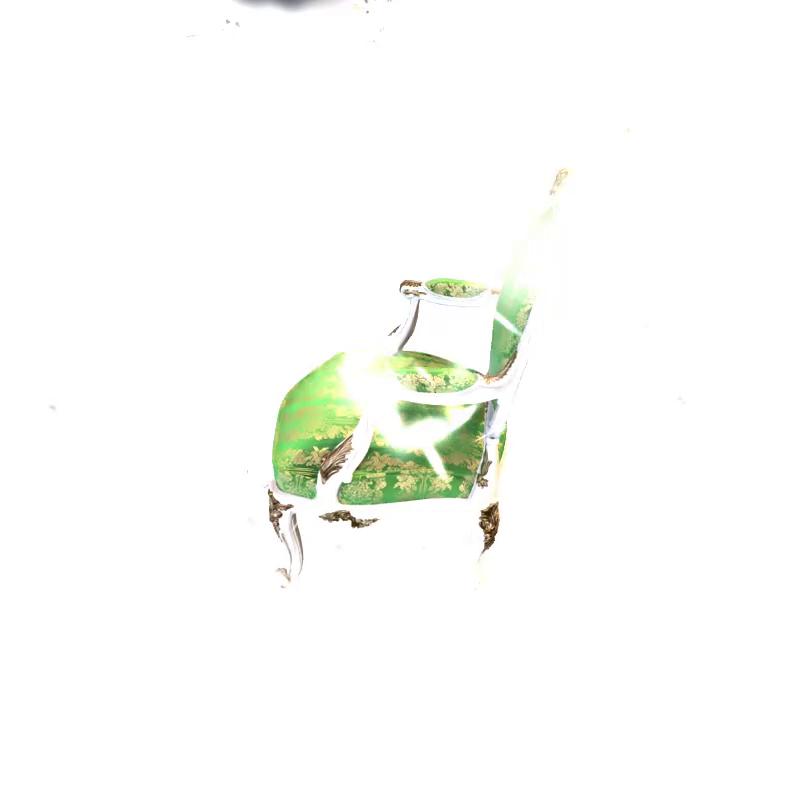 | 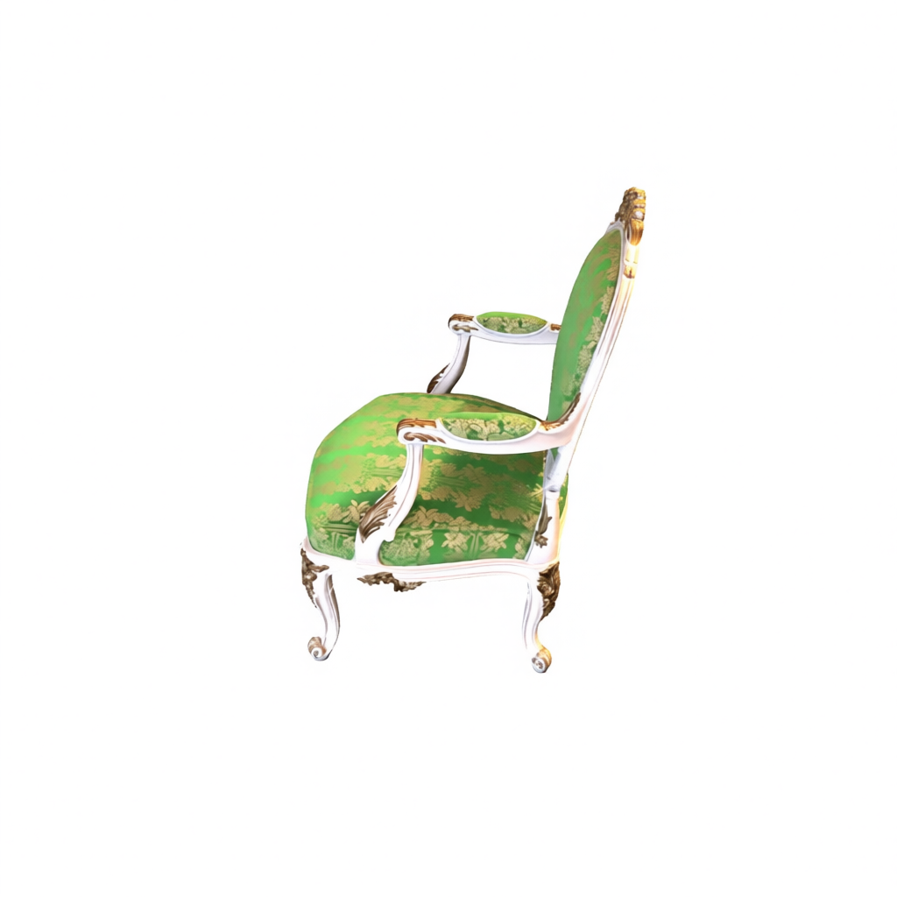
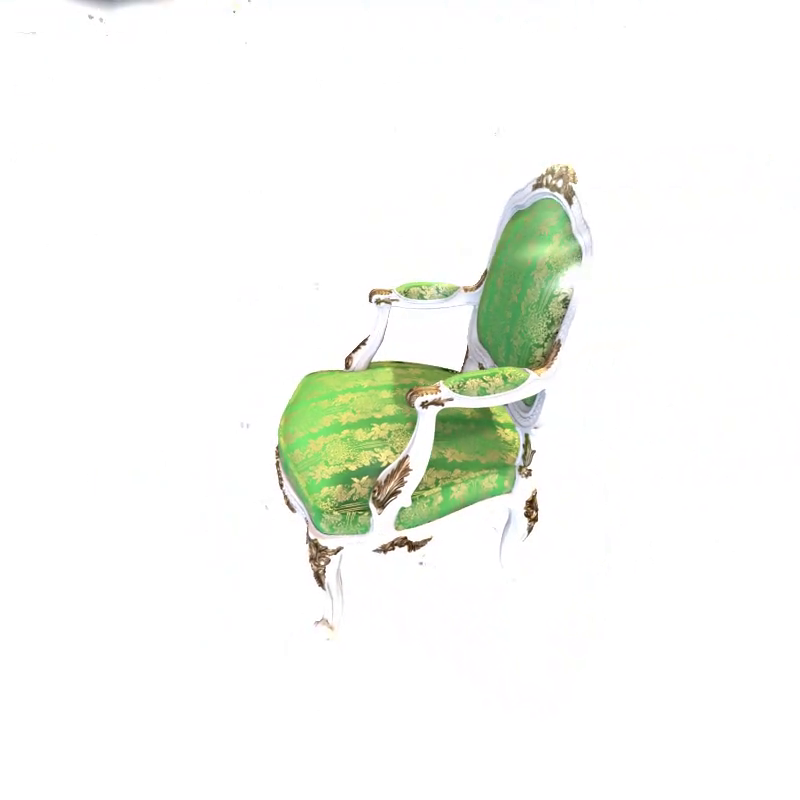 | 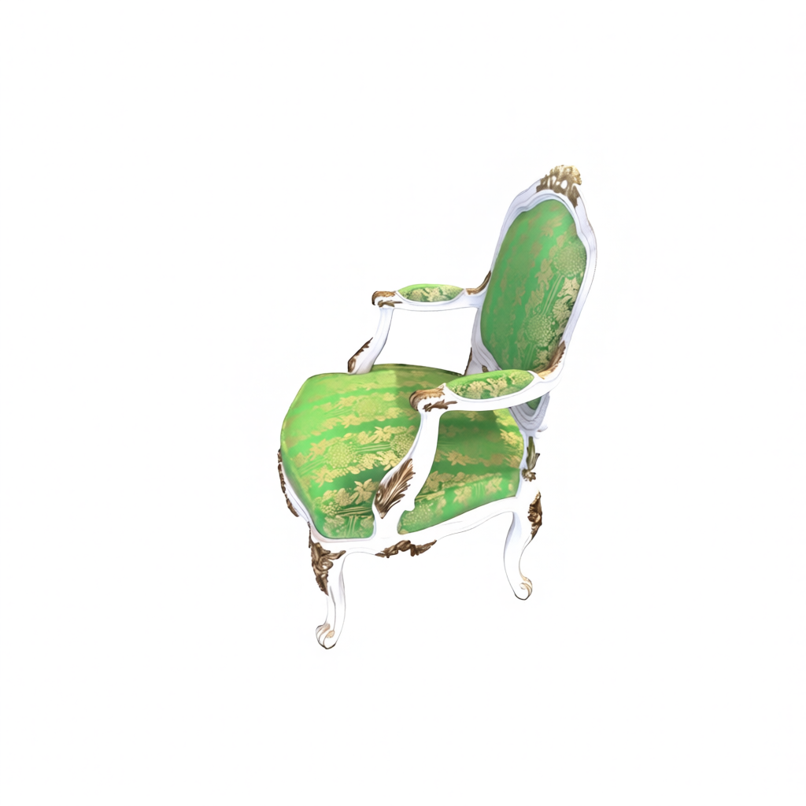


These examples illustrate the visual changes introduced by Qwen-based
post-processing, including noise reduction and local appearance refinement,
as well as occasional structural deviations.

### Comparison with Test Images and Retrained Results

To further examine the effect of Qwen-based post-processing in the context
of 3DGS training, we compare rendered views from models trained with and
without Qwen-edited images against the test set.

Test Image | Original 3DGS Render | Qwen-Augmented 3DGS Render
:--------------------:|:------------------:|:------------------:
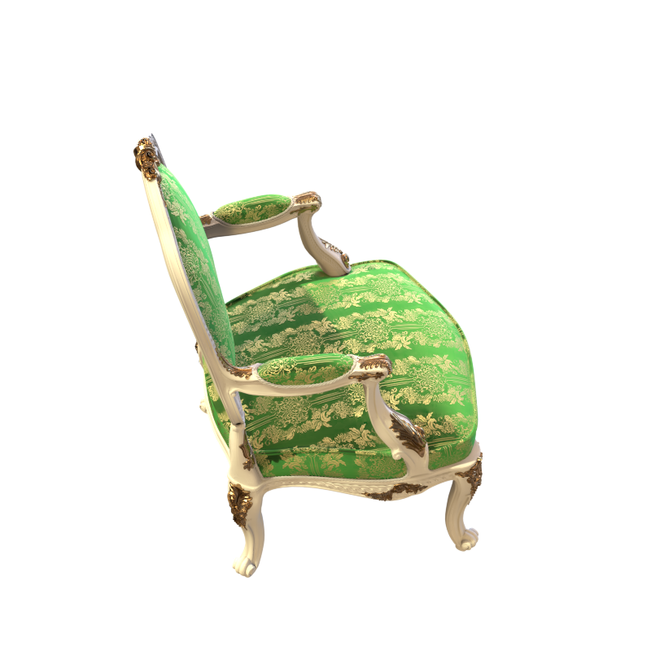 | 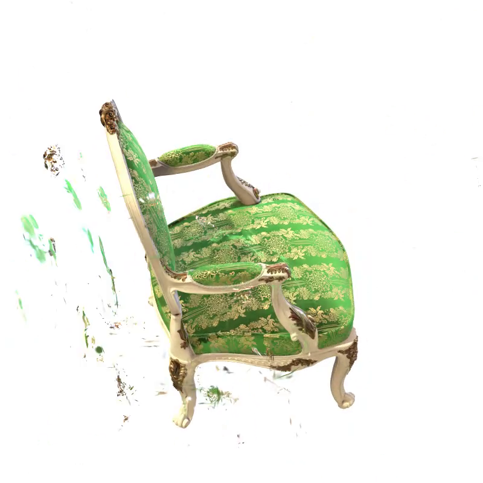 | 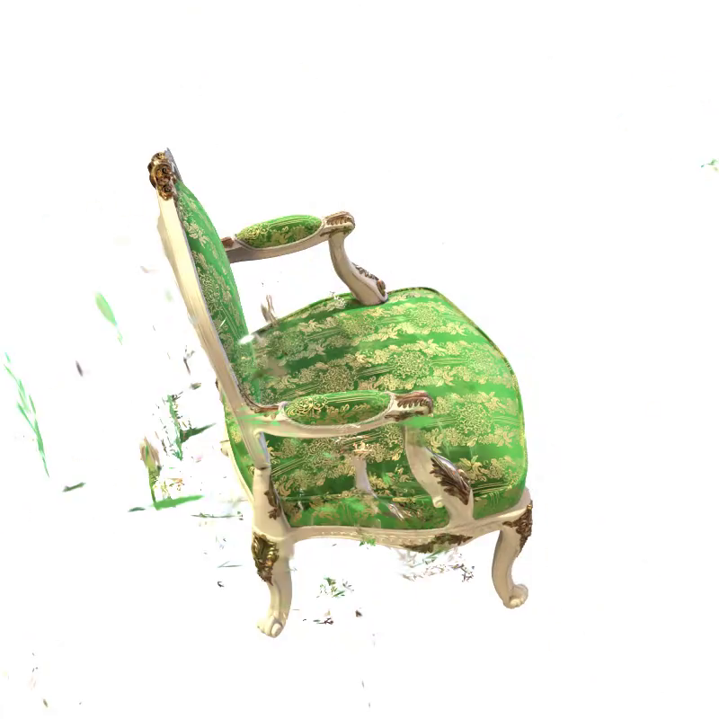

### Quantitative Results

We evaluate the effect of Qwen-based post-processing using three standard
image similarity metrics: PSNR, SSIM, and LPIPS.
Pairwise comparisons are conducted across the following image sets:

#### Test images vs. original 3DGS renders
| Metric | mean | std | min | q1 | median | q3 | max |
|---|---:|---:|---:|---:|---:|---:|---:|
| PSNR | 21.6244 | 7.7138 | 12.0763 | 14.5960 | 18.1496 | 28.4654 | 37.2606 |
| SSIM | 0.9050 | 0.0593 | 0.7730 | 0.8720 | 0.9097 | 0.9564 | 0.9909 |
| LPIPS | 0.1743 | 0.1151 | 0.0079 | 0.0661 | 0.1405 | 0.2920 | 0.4019 |

#### Test images vs. Qwen-edited renders
| Metric | mean | std | min | q1 | median | q3 | max |
|---|---:|---:|---:|---:|---:|---:|---:|
| PSNR | 18.3977 | 4.9964 | 12.2403 | 14.6016 | 17.3151 | 20.6450 | 34.0539 |
| SSIM | 0.8842 | 0.0496 | 0.7735 | 0.8694 | 0.8839 | 0.9132 | 0.9805 |
| LPIPS | 0.2130 | 0.0961 | 0.0372 | 0.1305 | 0.2191 | 0.2949 | 0.4800 |

#### Original 3DGS renders vs. Qwen-edited renders
| Metric | mean | std | min | q1 | median | q3 | max |
|---|---:|---:|---:|---:|---:|---:|---:|
| PSNR | 29.3138 | 12.6333 | 14.2407 | 20.3995 | 24.5813 | 33.5139 | 69.6476 |
| SSIM | 0.9428 | 0.0474 | 0.8193 | 0.9023 | 0.9495 | 0.9913 | 0.9999 |
| LPIPS | 0.1107 | 0.0752 | 0.0002 | 0.0462 | 0.1085 | 0.1721 | 0.2732 |

Complete quantitative results, including per-image metrics, distribution plots,
and qualitative comparisons of best and worst cases, are available under:
[`./qwen-image-edit/results/`](./qwen-image-edit/results/)

The comparisons between the test set and the two rendered variants show that
Qwen-based post-processing does not lead to consistent improvements across
any of the evaluated metrics.
In particular, test–Qwen comparisons do not outperform the baseline
test–3DGS results, indicating that Qwen-based editing does not bring the
rendered views closer to the ground-truth distribution.

Additionally, direct comparisons between original 3DGS renders and
Qwen-edited renders suggest that the overall magnitude of change introduced
by Qwen is limited.
While local visual differences are observable, these changes do not translate
into meaningful gains in global similarity metrics.

### Analysis and Discussion
Qualitative inspection shows that Qwen-based image editing can enhance
local appearance details, particularly object textures, and may enrich
visual diversity when incorporated into the training set.

However, as a purely 2D image diffusion model, Qwen does not explicitly
model 3D concepts such as camera pose, lighting consistency, or object
geometry.
As a result, each edited render may introduce subtle but inconsistent
variations in viewpoint-dependent appearance.

While these variations typically do not severely distort the main object
geometry in the final 3DGS reconstruction, they can accumulate across views
and manifest as additional floating artifacts (floaters) in the rendered scene.
This behavior provides a plausible explanation for the observed degradation
or lack of improvement in quantitative metrics.

Overall, the results suggest that although diffusion-based 2D image editing
can improve local texture quality, its lack of geometric and multi-view
consistency limits its effectiveness as a direct augmentation strategy
for sparse 3DGS training.


