# Metrics Report

- Pairs evaluated: **200**
- LPIPS backbone: **alex**

## Overall Summary

| Metric | mean | std | min | q1 | median | q3 | max |
|---|---:|---:|---:|---:|---:|---:|---:|
| PSNR | 29.3138 | 12.6333 | 14.2407 | 20.3995 | 24.5813 | 33.5139 | 69.6476 |
| SSIM | 0.9428 | 0.0474 | 0.8193 | 0.9023 | 0.9495 | 0.9913 | 0.9999 |
| LPIPS | 0.1107 | 0.0752 | 0.0002 | 0.0462 | 0.1085 | 0.1721 | 0.2732 |

## Distributions

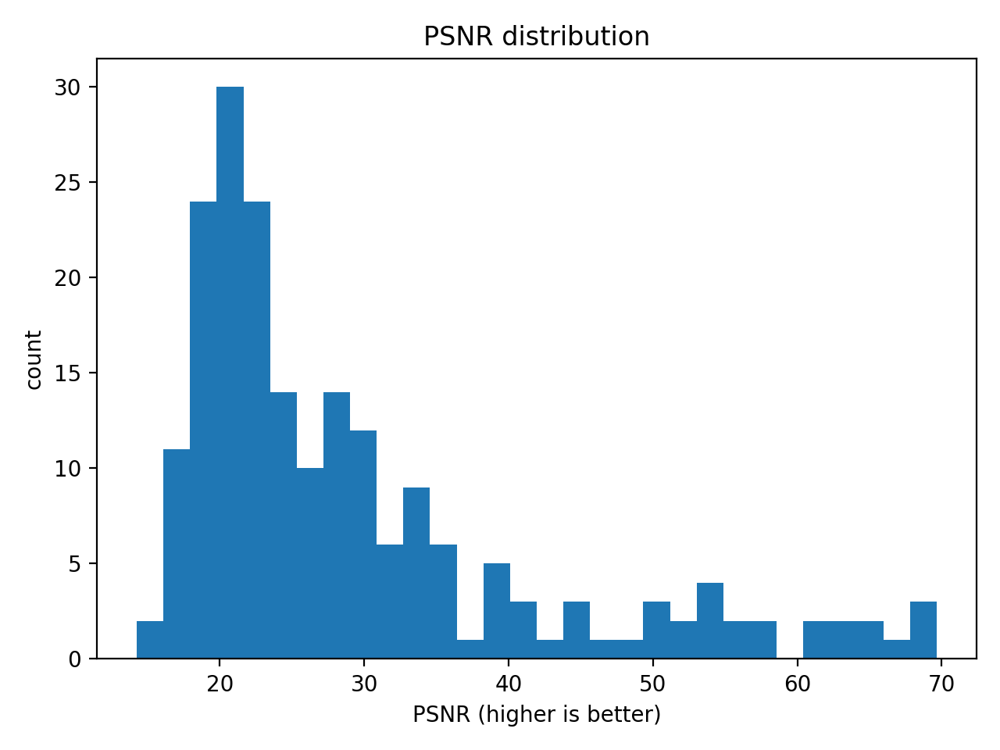

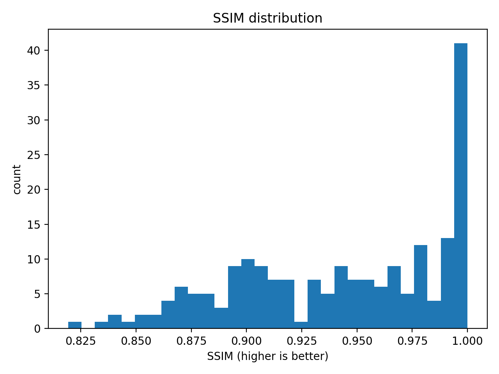

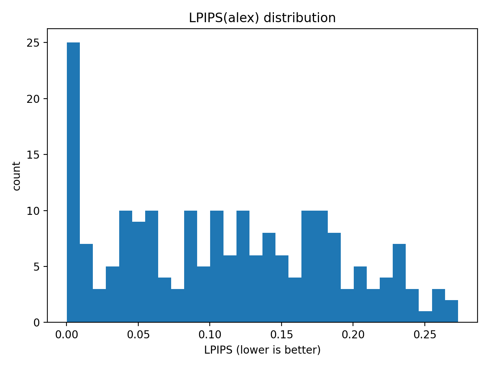

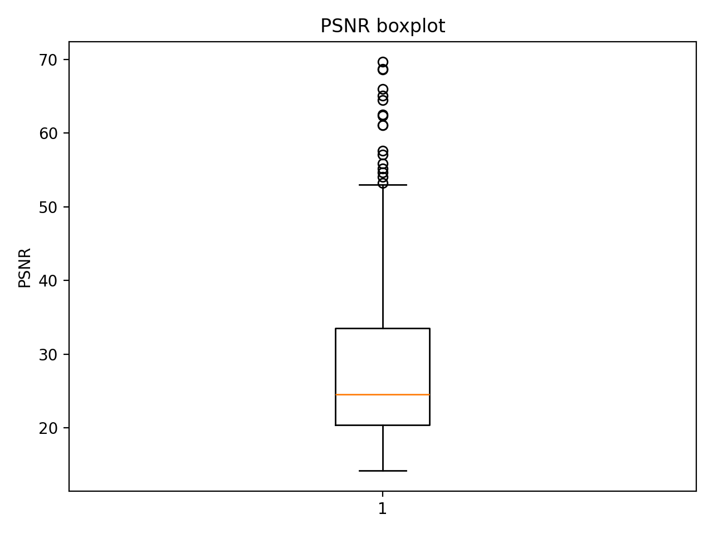

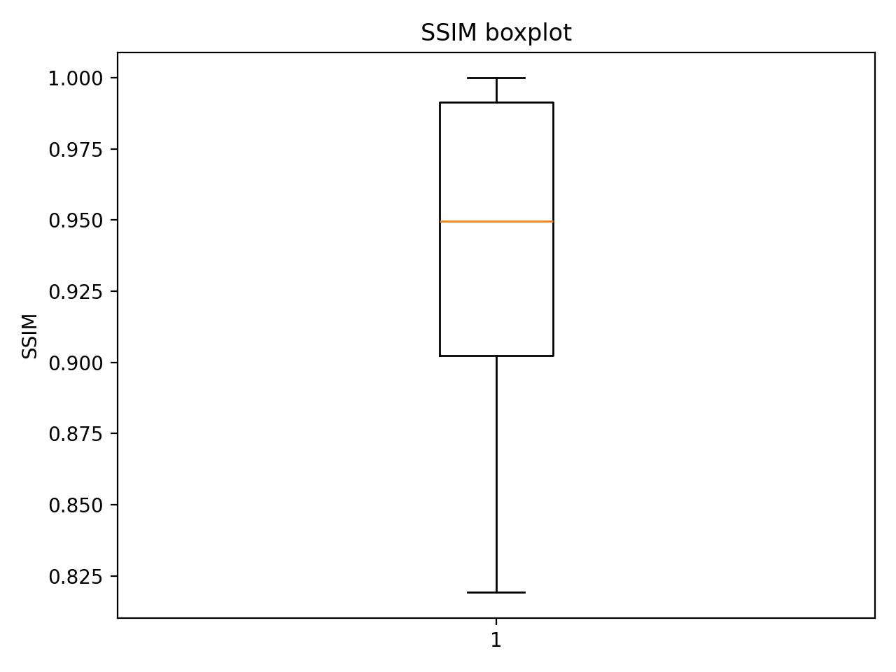

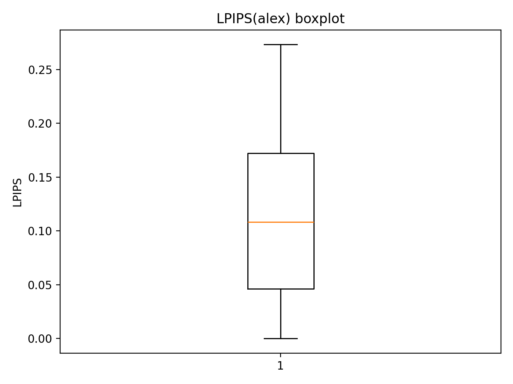

## Correlations

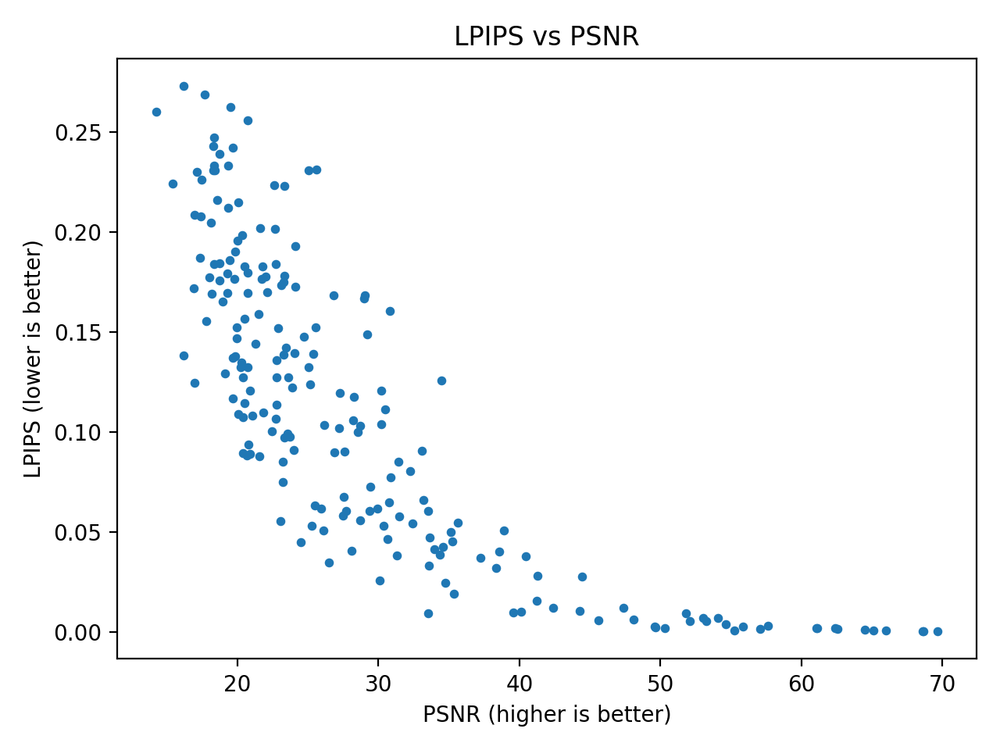

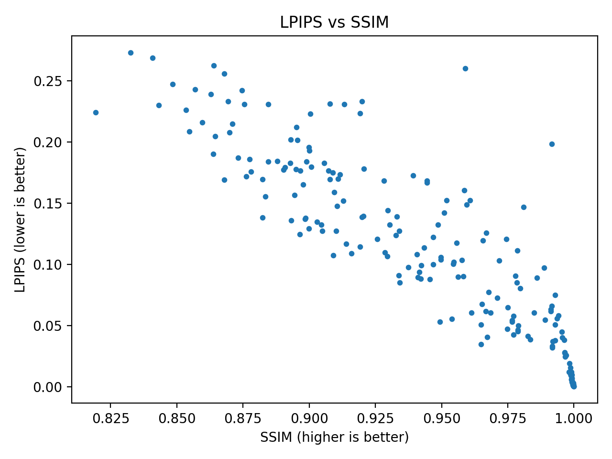

## Best / Worst Examples (Top-K)

### Best PSNR (higher is better)

| rank | filename | value |
|---:|---|---:|
| 1 | r_56.png | 69.6476 |
| 2 | r_58.png | 68.6734 |
| 3 | r_57.png | 68.5944 |
| 4 | r_80.png | 66.0174 |
| 5 | r_79.png | 65.0859 |
| 6 | r_78.png | 64.5074 |
| 7 | r_100.png | 62.5443 |
| 8 | r_66.png | 62.3665 |
| 9 | r_113.png | 61.0905 |
| 10 | r_112.png | 61.0856 |

### Worst PSNR (lower is worse)

| rank | filename | value |
|---:|---|---:|
| 1 | r_99.png | 14.2407 |
| 2 | r_162.png | 15.4248 |
| 3 | r_41.png | 16.1945 |
| 4 | r_47.png | 16.1992 |
| 5 | r_42.png | 16.8843 |
| 6 | r_40.png | 16.9700 |
| 7 | r_159.png | 16.9732 |
| 8 | r_158.png | 17.1401 |
| 9 | r_43.png | 17.3142 |
| 10 | r_44.png | 17.4035 |

### Best SSIM (higher is better)

| rank | filename | value |
|---:|---|---:|
| 1 | r_58.png | 0.9999 |
| 2 | r_56.png | 0.9999 |
| 3 | r_57.png | 0.9999 |
| 4 | r_80.png | 0.9998 |
| 5 | r_79.png | 0.9998 |
| 6 | r_78.png | 0.9998 |
| 7 | r_134.png | 0.9998 |
| 8 | r_89.png | 0.9998 |
| 9 | r_100.png | 0.9997 |
| 10 | r_86.png | 0.9997 |

### Worst SSIM (lower is worse)

| rank | filename | value |
|---:|---|---:|
| 1 | r_162.png | 0.8193 |
| 2 | r_47.png | 0.8325 |
| 3 | r_48.png | 0.8409 |
| 4 | r_158.png | 0.8431 |
| 5 | r_177.png | 0.8483 |
| 6 | r_161.png | 0.8535 |
| 7 | r_159.png | 0.8547 |
| 8 | r_178.png | 0.8569 |
| 9 | r_139.png | 0.8596 |
| 10 | r_173.png | 0.8628 |

### Best LPIPS (lower is better)

| rank | filename | value |
|---:|---|---:|
| 1 | r_58.png | 0.0002 |
| 2 | r_56.png | 0.0002 |
| 3 | r_57.png | 0.0003 |
| 4 | r_80.png | 0.0008 |
| 5 | r_79.png | 0.0008 |
| 6 | r_89.png | 0.0009 |
| 7 | r_78.png | 0.0010 |
| 8 | r_100.png | 0.0015 |
| 9 | r_105.png | 0.0016 |
| 10 | r_66.png | 0.0018 |

### Worst LPIPS (higher is worse)

| rank | filename | value |
|---:|---|---:|
| 1 | r_47.png | 0.2732 |
| 2 | r_48.png | 0.2686 |
| 3 | r_172.png | 0.2624 |
| 4 | r_99.png | 0.2601 |
| 5 | r_50.png | 0.2560 |
| 6 | r_177.png | 0.2473 |
| 7 | r_178.png | 0.2430 |
| 8 | r_171.png | 0.2423 |
| 9 | r_173.png | 0.2391 |
| 10 | r_174.png | 0.2332 |

## Qualitative Comparisons

Each image shows **Folder A (left)** and **Folder B (right)**.

- Examples are saved under `examples/`.

### Best LPIPS examples

### Worst LPIPS examples

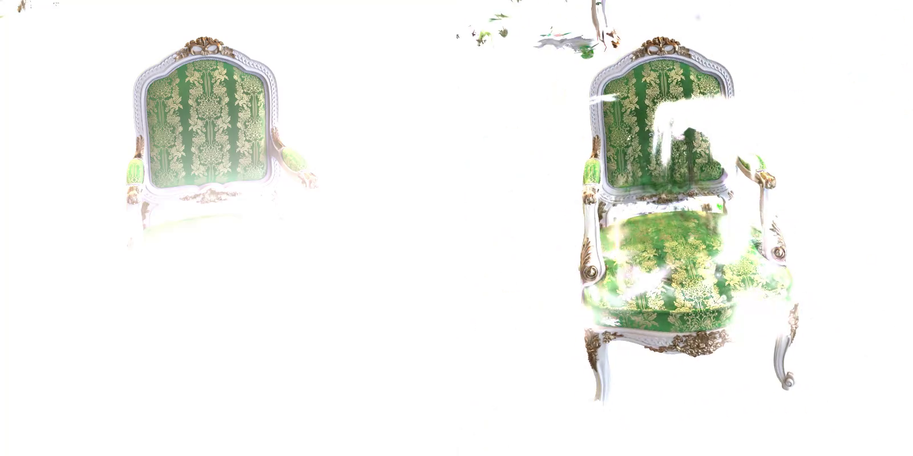

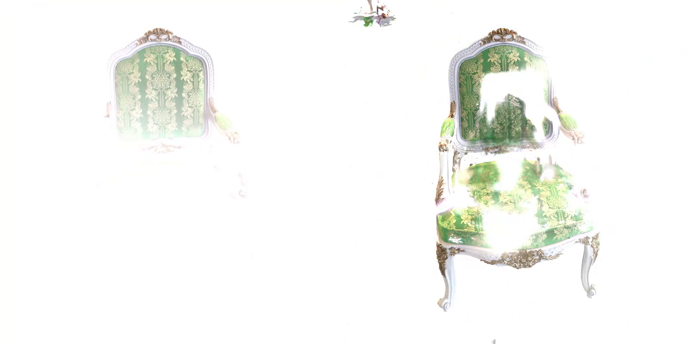

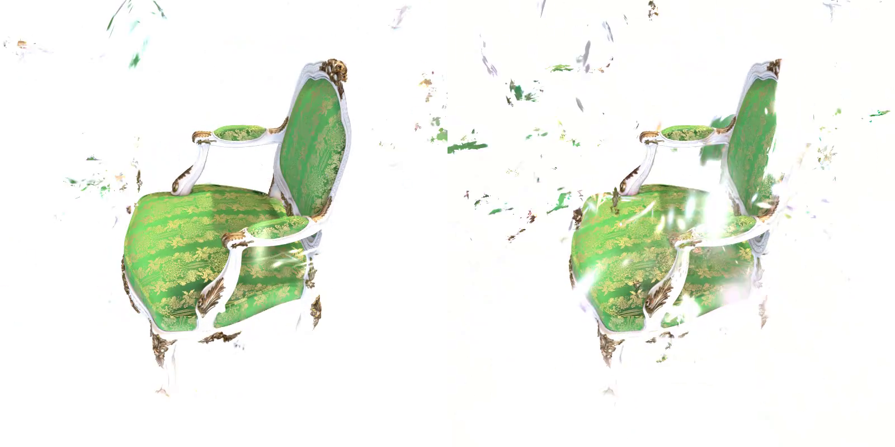

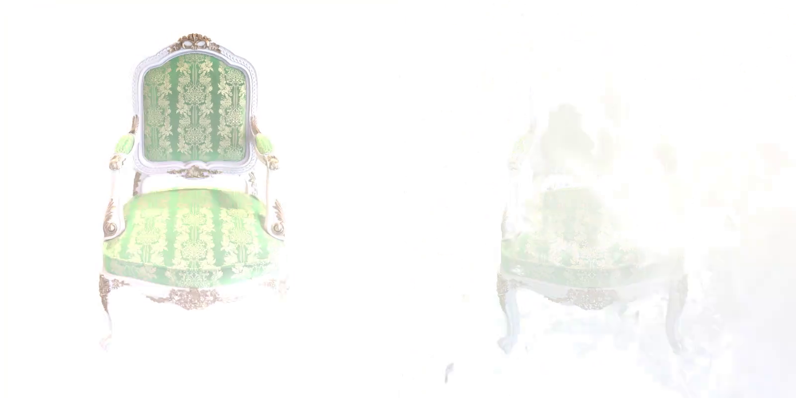

