# Metrics Report

- Pairs evaluated: **200**
- LPIPS backbone: **alex**

## Overall Summary

| Metric | mean | std | min | q1 | median | q3 | max |
|---|---:|---:|---:|---:|---:|---:|---:|
| PSNR | 21.6244 | 7.7138 | 12.0763 | 14.5960 | 18.1496 | 28.4654 | 37.2606 |
| SSIM | 0.9050 | 0.0593 | 0.7730 | 0.8720 | 0.9097 | 0.9564 | 0.9909 |
| LPIPS | 0.1743 | 0.1151 | 0.0079 | 0.0661 | 0.1405 | 0.2920 | 0.4019 |

## Distributions

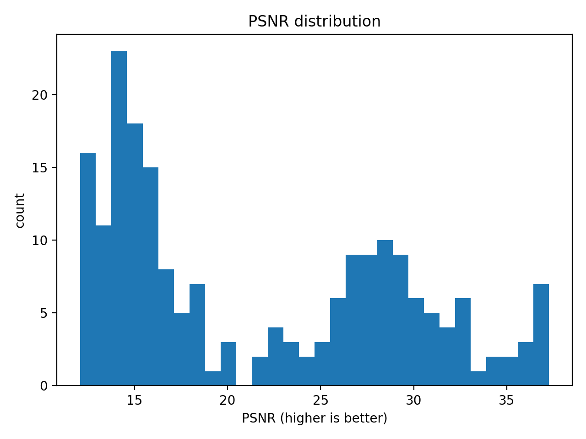

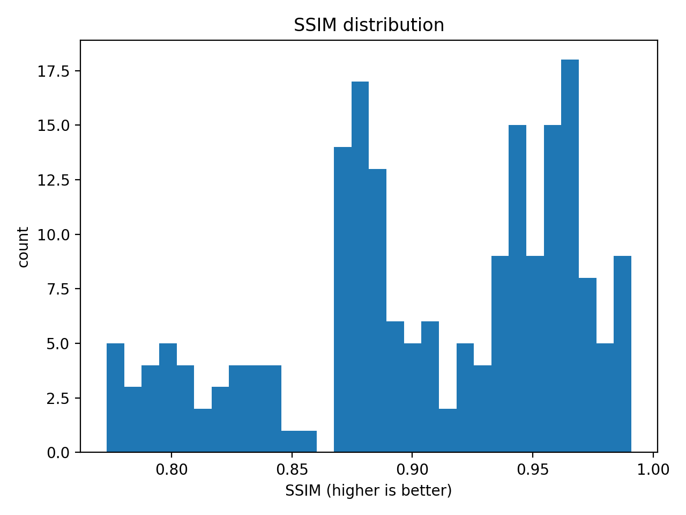

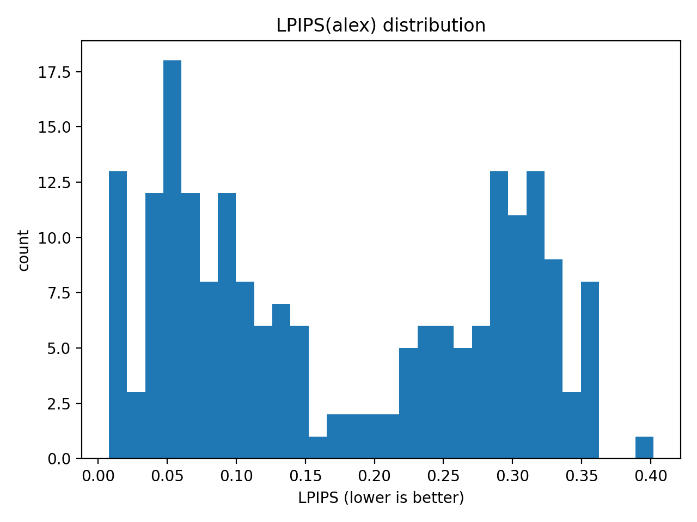

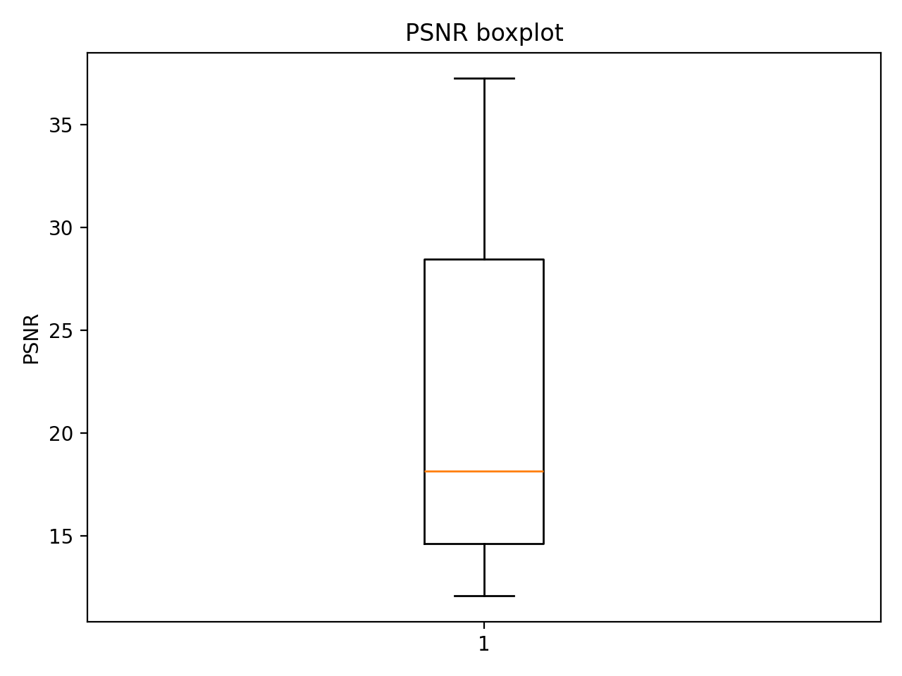

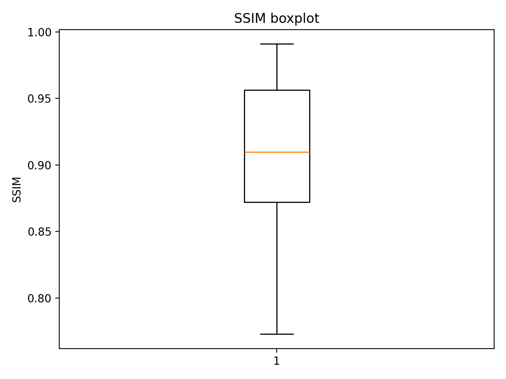

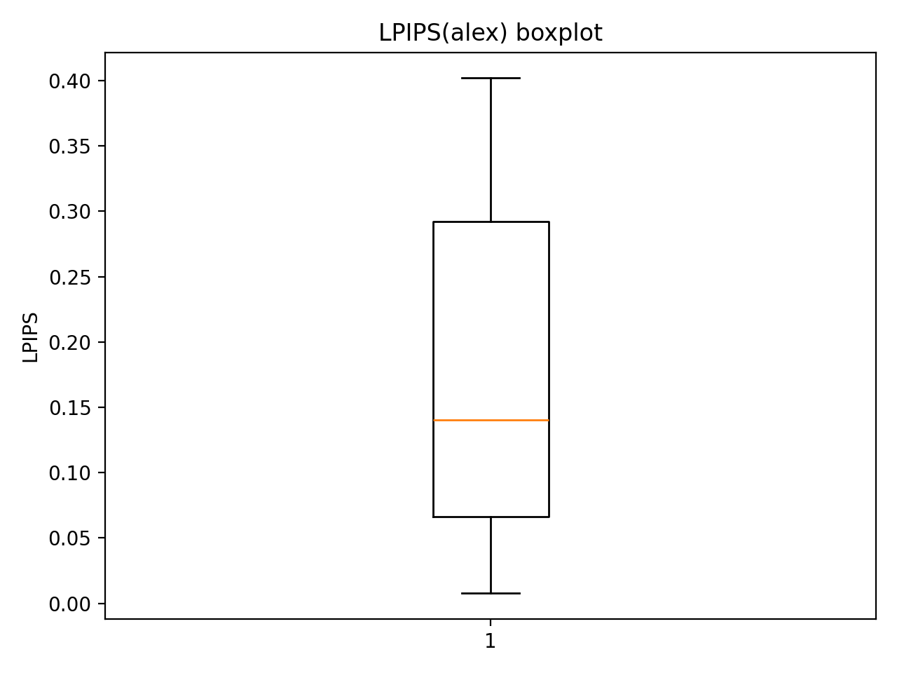

## Correlations

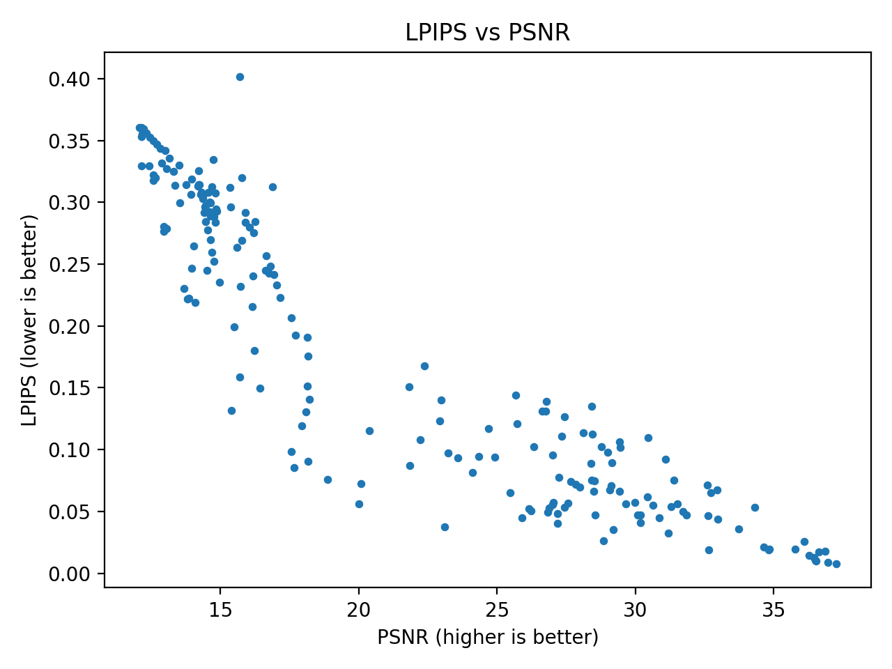

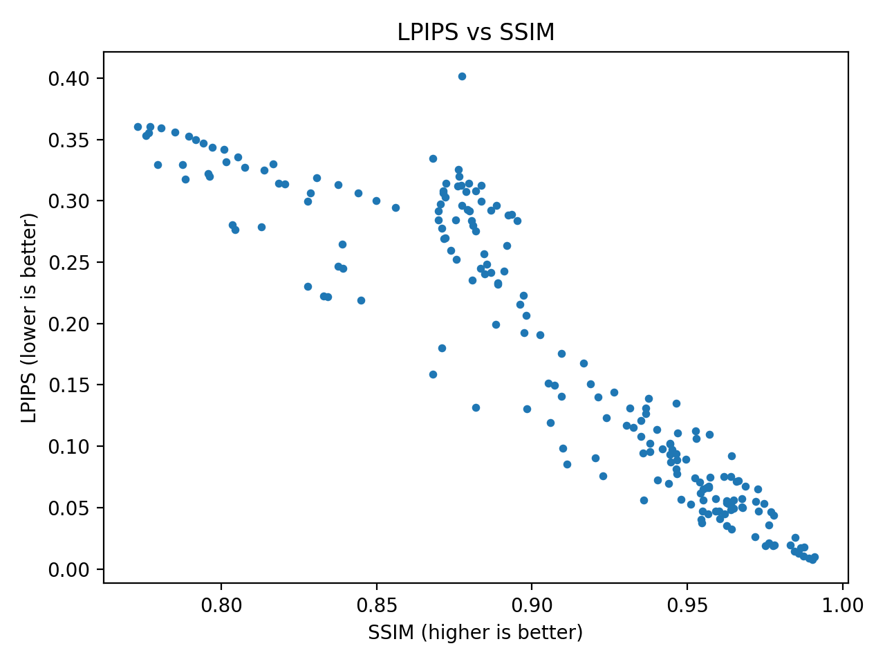

## Best / Worst Examples (Top-K)

### Best PSNR (higher is better)

| rank | filename | value |
|---:|---|---:|
| 1 | r_1.png | 37.2606 |
| 2 | r_2.png | 36.9677 |
| 3 | r_199.png | 36.8556 |
| 4 | r_198.png | 36.6417 |
| 5 | r_0.png | 36.5351 |
| 6 | r_3.png | 36.5064 |
| 7 | r_197.png | 36.4556 |
| 8 | r_196.png | 36.2734 |
| 9 | r_4.png | 36.0940 |
| 10 | r_195.png | 35.7729 |

### Worst PSNR (lower is worse)

| rank | filename | value |
|---:|---|---:|
| 1 | r_147.png | 12.0763 |
| 2 | r_146.png | 12.1510 |
| 3 | r_148.png | 12.1577 |
| 4 | r_52.png | 12.1601 |
| 5 | r_145.png | 12.1638 |
| 6 | r_53.png | 12.2330 |
| 7 | r_54.png | 12.3394 |
| 8 | r_152.png | 12.4238 |
| 9 | r_55.png | 12.4562 |
| 10 | r_149.png | 12.5716 |

### Best SSIM (higher is better)

| rank | filename | value |
|---:|---|---:|
| 1 | r_0.png | 0.9909 |
| 2 | r_1.png | 0.9904 |
| 3 | r_2.png | 0.9891 |
| 4 | r_199.png | 0.9876 |
| 5 | r_3.png | 0.9874 |
| 6 | r_198.png | 0.9865 |
| 7 | r_197.png | 0.9859 |
| 8 | r_4.png | 0.9848 |
| 9 | r_196.png | 0.9846 |
| 10 | r_195.png | 0.9831 |

### Worst SSIM (lower is worse)

| rank | filename | value |
|---:|---|---:|
| 1 | r_147.png | 0.7730 |
| 2 | r_146.png | 0.7756 |
| 3 | r_145.png | 0.7766 |
| 4 | r_52.png | 0.7770 |
| 5 | r_148.png | 0.7795 |
| 6 | r_53.png | 0.7806 |
| 7 | r_54.png | 0.7851 |
| 8 | r_152.png | 0.7875 |
| 9 | r_149.png | 0.7884 |
| 10 | r_55.png | 0.7895 |

### Best LPIPS (lower is better)

| rank | filename | value |
|---:|---|---:|
| 1 | r_1.png | 0.0079 |
| 2 | r_2.png | 0.0087 |
| 3 | r_0.png | 0.0101 |
| 4 | r_3.png | 0.0105 |
| 5 | r_197.png | 0.0127 |
| 6 | r_196.png | 0.0141 |
| 7 | r_198.png | 0.0174 |
| 8 | r_199.png | 0.0176 |
| 9 | r_190.png | 0.0187 |
| 10 | r_128.png | 0.0188 |

### Worst LPIPS (higher is worse)

| rank | filename | value |
|---:|---|---:|
| 1 | r_83.png | 0.4019 |
| 2 | r_147.png | 0.3606 |
| 3 | r_52.png | 0.3606 |
| 4 | r_53.png | 0.3592 |
| 5 | r_54.png | 0.3559 |
| 6 | r_145.png | 0.3553 |
| 7 | r_146.png | 0.3532 |
| 8 | r_55.png | 0.3527 |
| 9 | r_56.png | 0.3500 |
| 10 | r_57.png | 0.3472 |

## Qualitative Comparisons

Each image shows **Folder A (left)** and **Folder B (right)**.

- Examples are saved under `examples/`.

### Best LPIPS examples

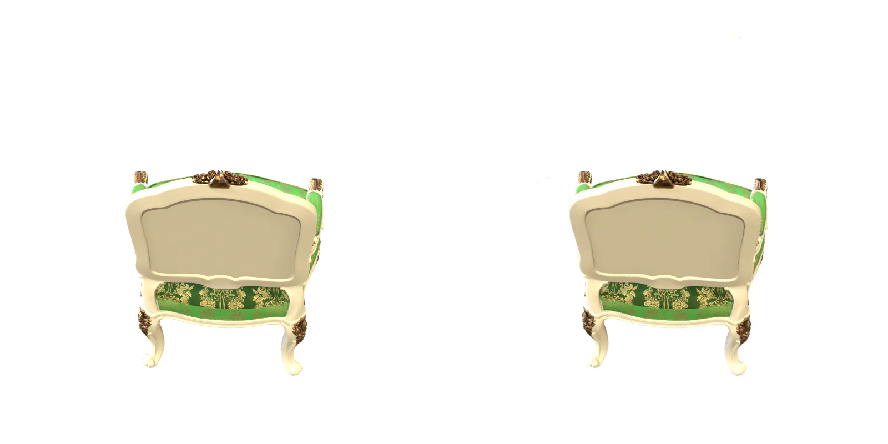

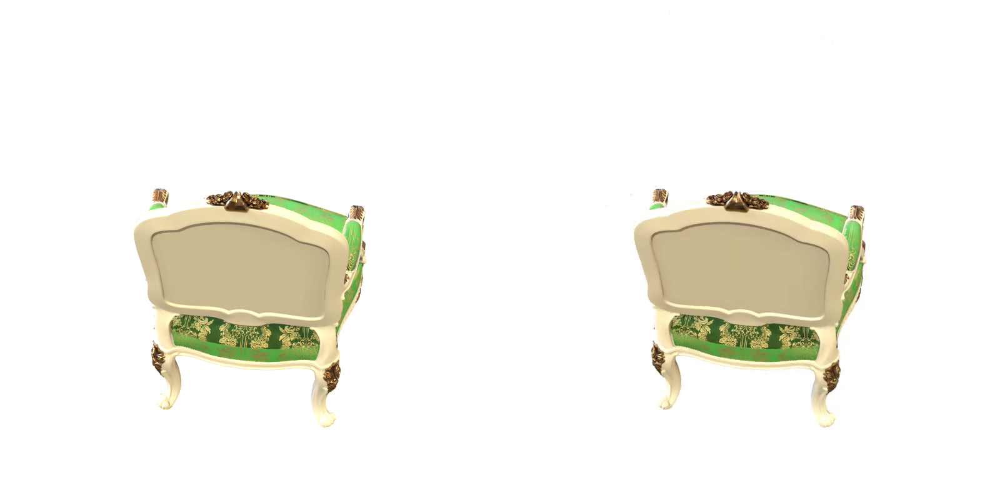

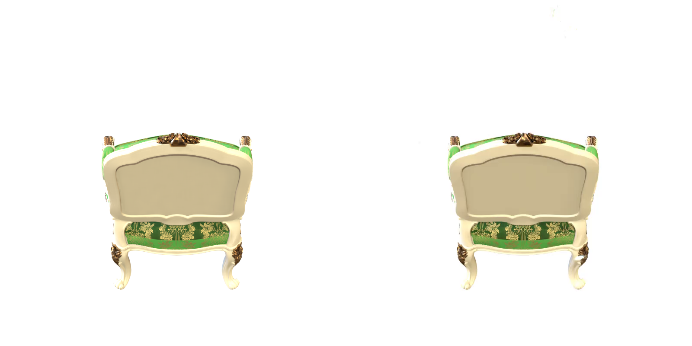

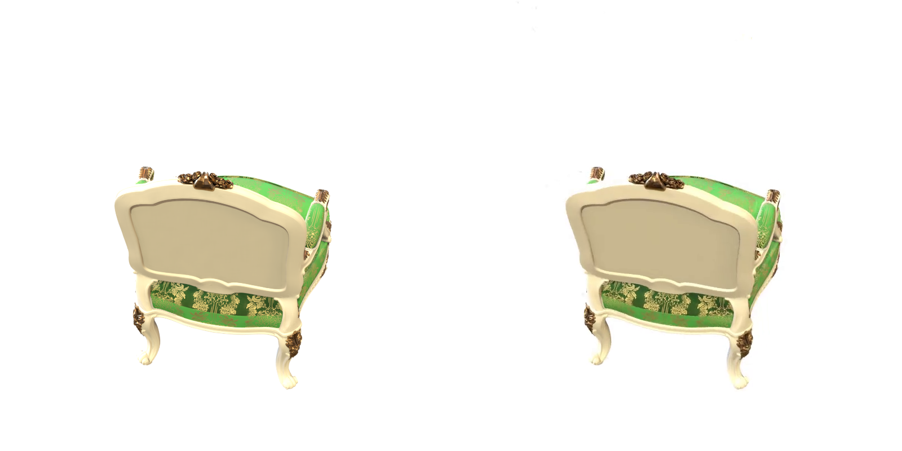

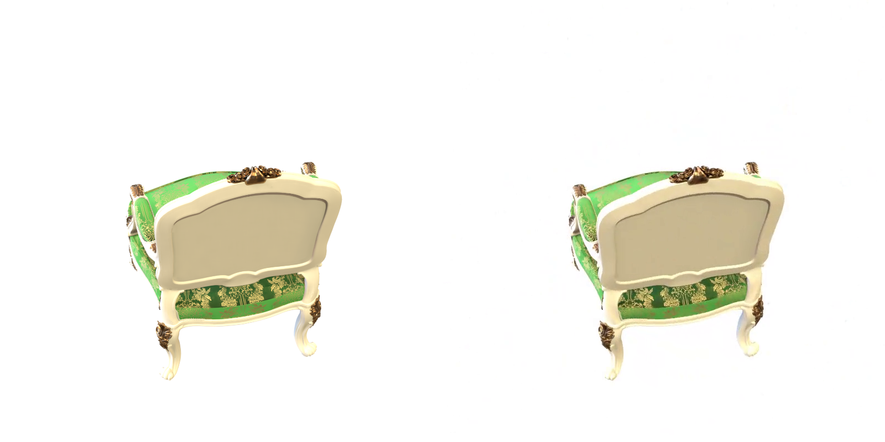

### Worst LPIPS examples

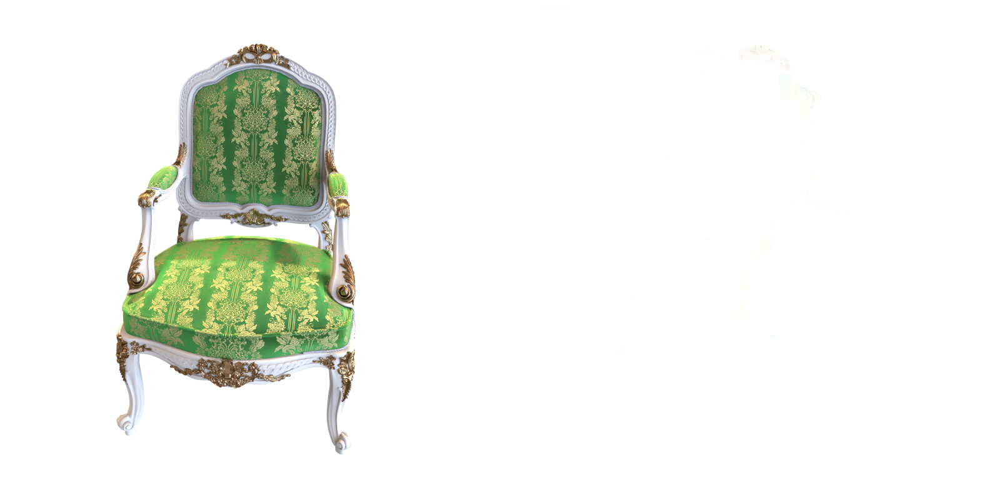

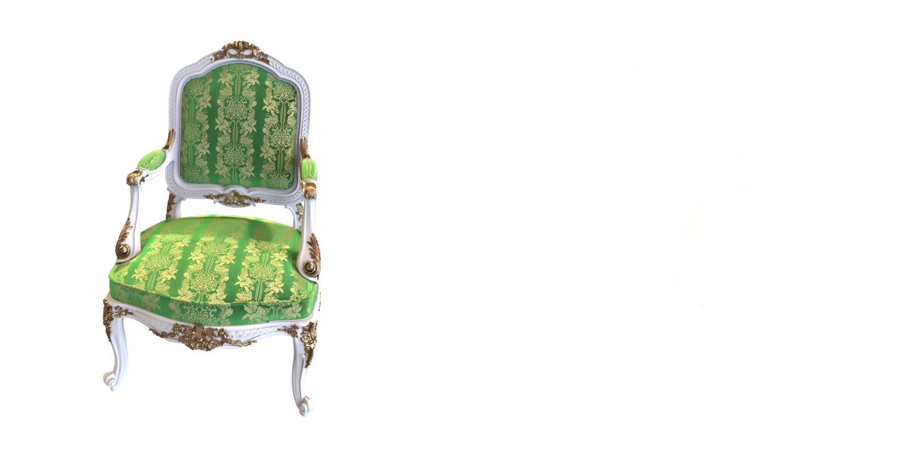

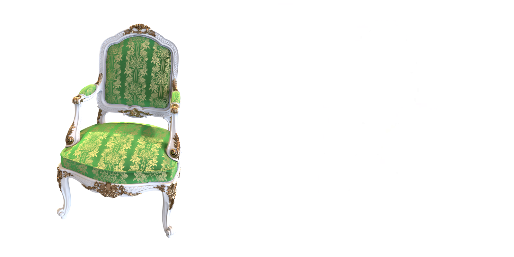

