# Metrics Report

- Pairs evaluated: **200**
- LPIPS backbone: **alex**

## Overall Summary

| Metric | mean | std | min | q1 | median | q3 | max |
|---|---:|---:|---:|---:|---:|---:|---:|
| PSNR | 18.3977 | 4.9964 | 12.2403 | 14.6016 | 17.3151 | 20.6450 | 34.0539 |
| SSIM | 0.8842 | 0.0496 | 0.7735 | 0.8694 | 0.8839 | 0.9132 | 0.9805 |
| LPIPS | 0.2130 | 0.0961 | 0.0372 | 0.1305 | 0.2191 | 0.2949 | 0.4800 |

## Distributions

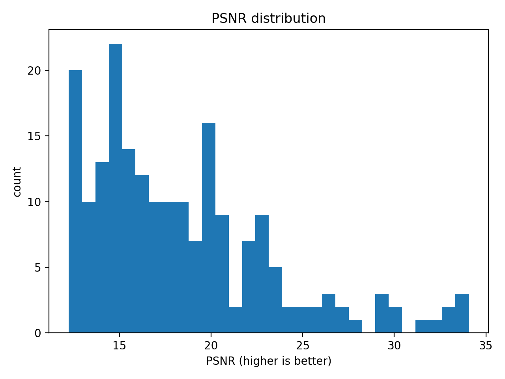

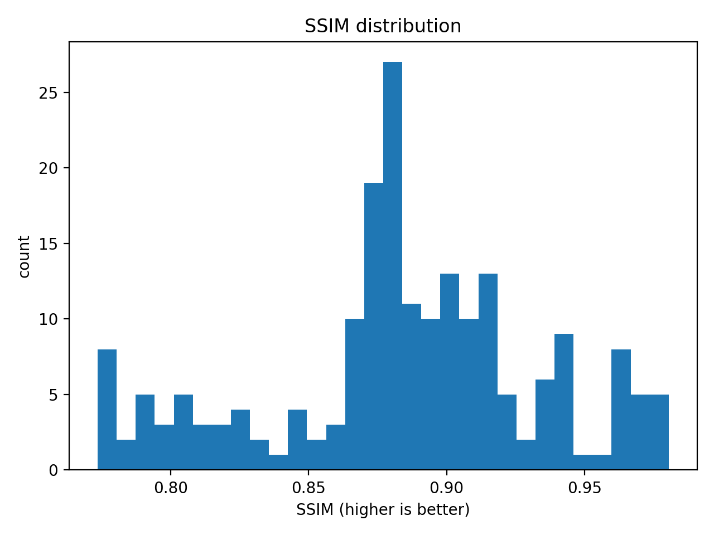

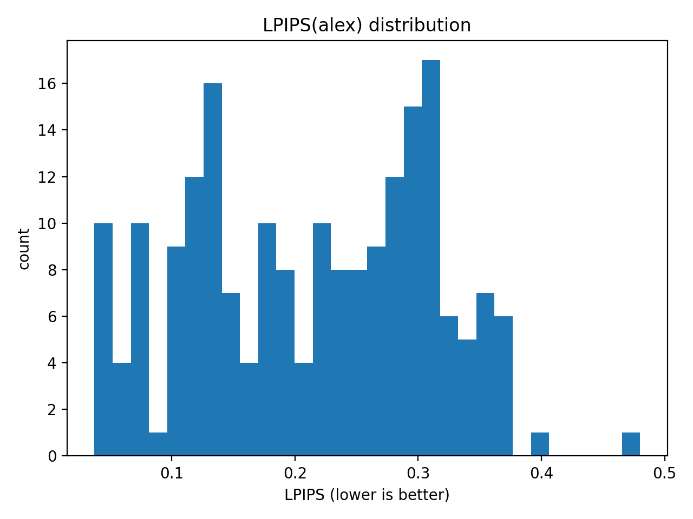

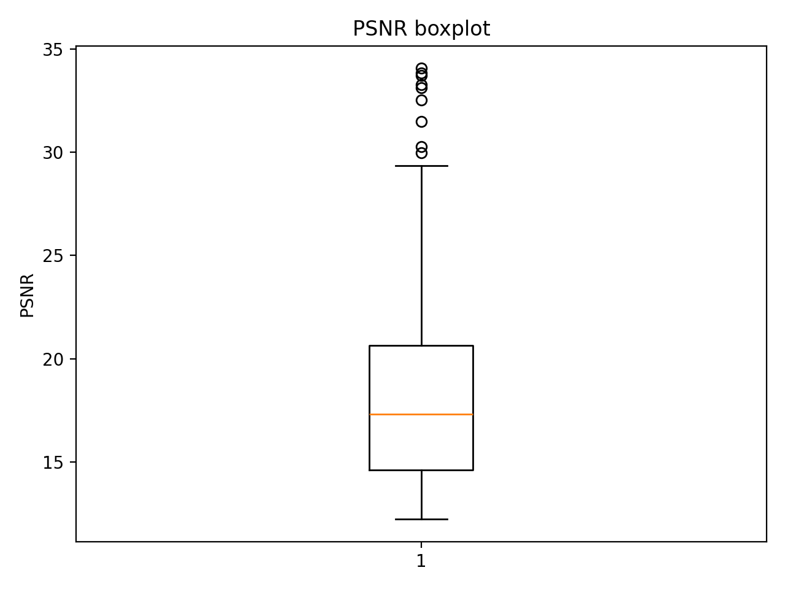

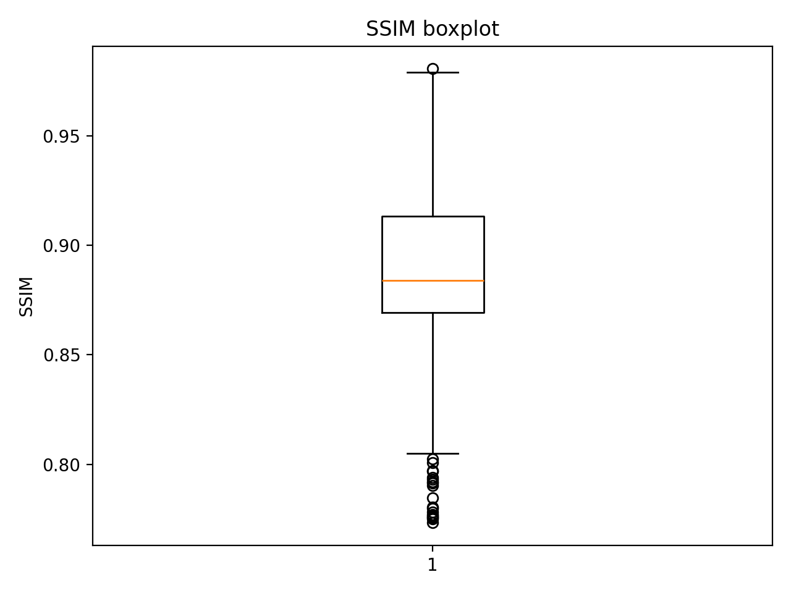

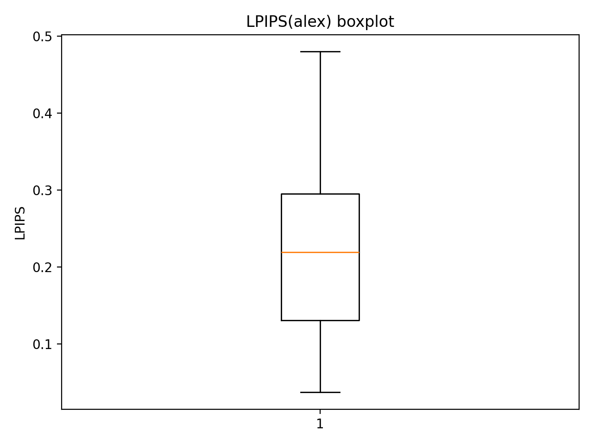

## Correlations

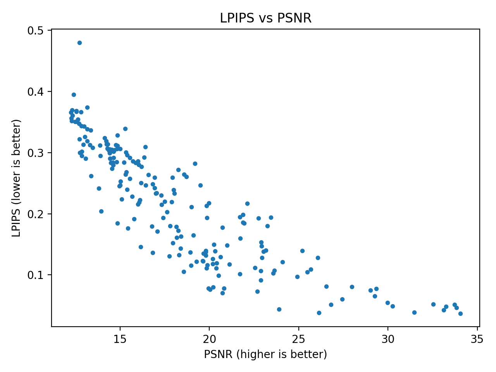

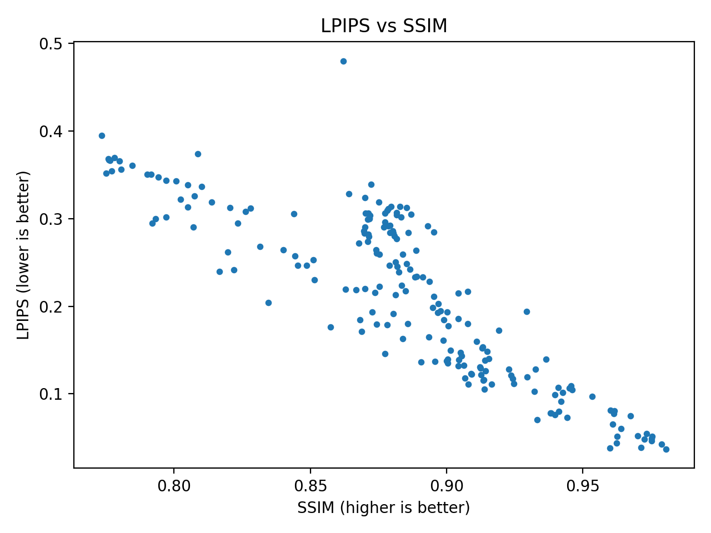

## Best / Worst Examples (Top-K)

### Best PSNR (higher is better)

| rank | filename | value |
|---:|---|---:|
| 1 | r_0.png | 34.0539 |
| 2 | r_198.png | 33.8242 |
| 3 | r_199.png | 33.7156 |
| 4 | r_197.png | 33.2505 |
| 5 | r_1.png | 33.1132 |
| 6 | r_196.png | 32.5247 |
| 7 | r_8.png | 31.4762 |
| 8 | r_2.png | 30.2512 |
| 9 | r_3.png | 29.9662 |
| 10 | r_7.png | 29.3482 |

### Worst PSNR (lower is worse)

| rank | filename | value |
|---:|---|---:|
| 1 | r_53.png | 12.2403 |
| 2 | r_153.png | 12.2744 |
| 3 | r_147.png | 12.2958 |
| 4 | r_152.png | 12.3132 |
| 5 | r_54.png | 12.3375 |
| 6 | r_52.png | 12.3897 |
| 7 | r_55.png | 12.4824 |
| 8 | r_151.png | 12.5446 |
| 9 | r_51.png | 12.5450 |
| 10 | r_56.png | 12.5754 |

### Best SSIM (higher is better)

| rank | filename | value |
|---:|---|---:|
| 1 | r_0.png | 0.9805 |
| 2 | r_1.png | 0.9790 |
| 3 | r_199.png | 0.9754 |
| 4 | r_198.png | 0.9753 |
| 5 | r_2.png | 0.9752 |
| 6 | r_3.png | 0.9733 |
| 7 | r_197.png | 0.9725 |
| 8 | r_8.png | 0.9714 |
| 9 | r_196.png | 0.9701 |
| 10 | r_4.png | 0.9674 |

### Worst SSIM (lower is worse)

| rank | filename | value |
|---:|---|---:|
| 1 | r_52.png | 0.7735 |
| 2 | r_147.png | 0.7751 |
| 3 | r_151.png | 0.7758 |
| 4 | r_51.png | 0.7760 |
| 5 | r_150.png | 0.7766 |
| 6 | r_50.png | 0.7771 |
| 7 | r_152.png | 0.7782 |
| 8 | r_53.png | 0.7800 |
| 9 | r_153.png | 0.7805 |
| 10 | r_54.png | 0.7847 |

### Best LPIPS (lower is better)

| rank | filename | value |
|---:|---|---:|
| 1 | r_0.png | 0.0372 |
| 2 | r_128.png | 0.0382 |
| 3 | r_8.png | 0.0390 |
| 4 | r_1.png | 0.0429 |
| 5 | r_127.png | 0.0436 |
| 6 | r_198.png | 0.0463 |
| 7 | r_197.png | 0.0483 |
| 8 | r_2.png | 0.0487 |
| 9 | r_199.png | 0.0512 |
| 10 | r_124.png | 0.0515 |

### Worst LPIPS (higher is worse)

| rank | filename | value |
|---:|---|---:|
| 1 | r_99.png | 0.4800 |
| 2 | r_52.png | 0.3952 |
| 3 | r_62.png | 0.3738 |
| 4 | r_152.png | 0.3694 |
| 5 | r_151.png | 0.3682 |
| 6 | r_51.png | 0.3669 |
| 7 | r_150.png | 0.3665 |
| 8 | r_53.png | 0.3657 |
| 9 | r_54.png | 0.3606 |
| 10 | r_153.png | 0.3562 |

## Qualitative Comparisons

Each image shows **Folder A (left)** and **Folder B (right)**.

- Examples are saved under `examples/`.

### Best LPIPS examples

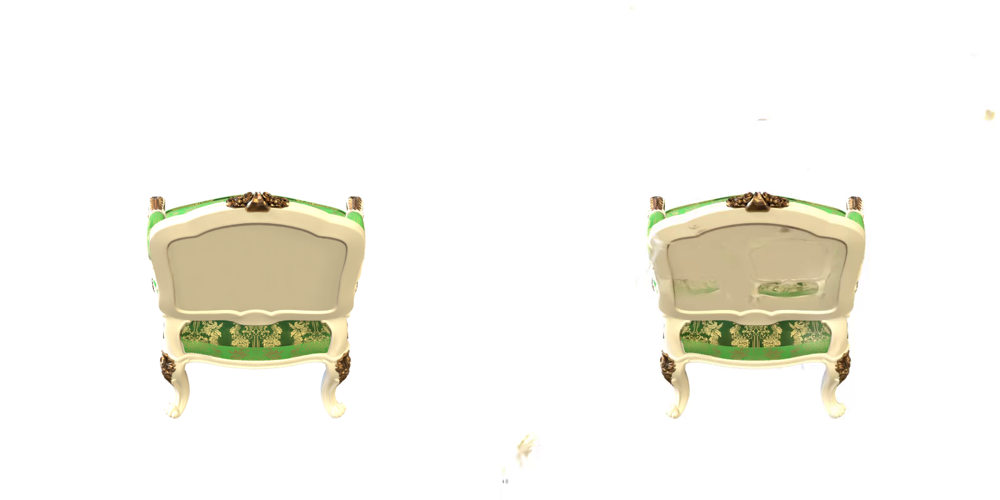

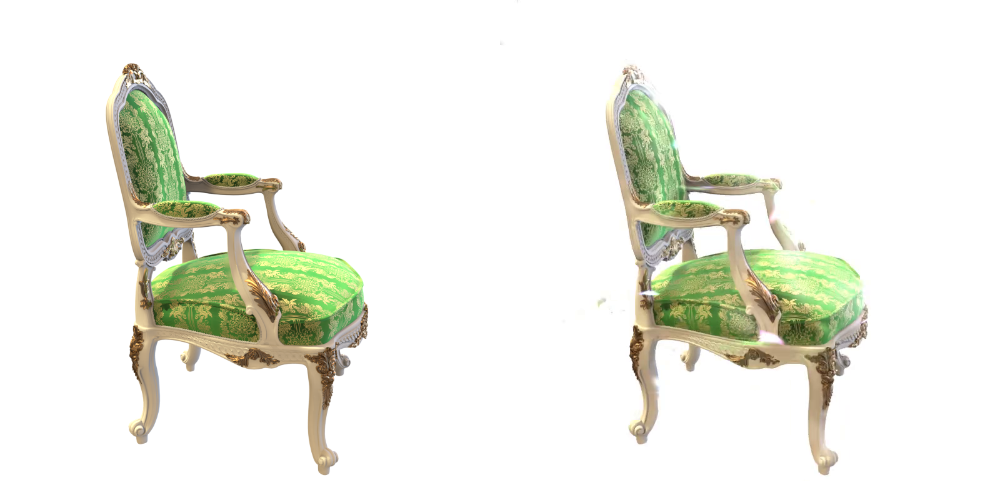

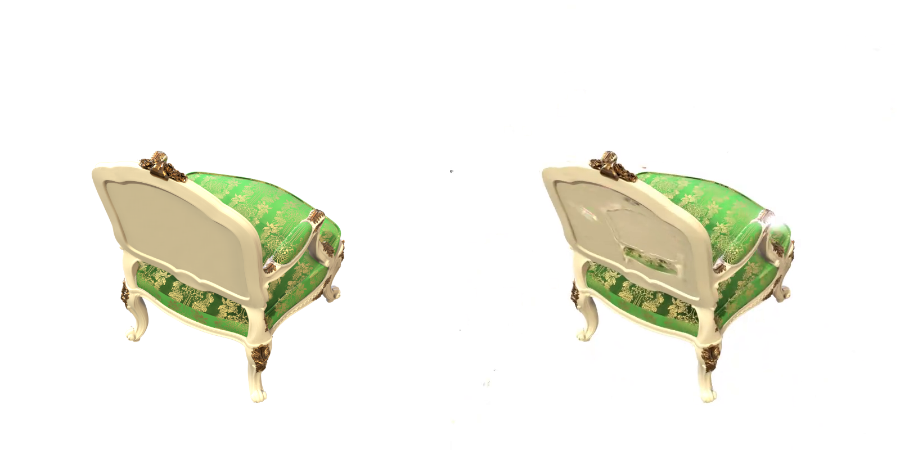

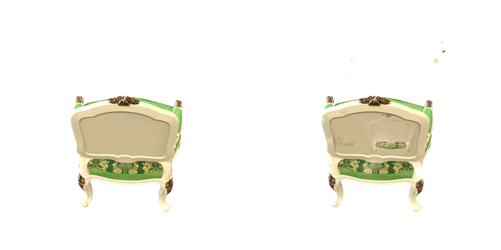

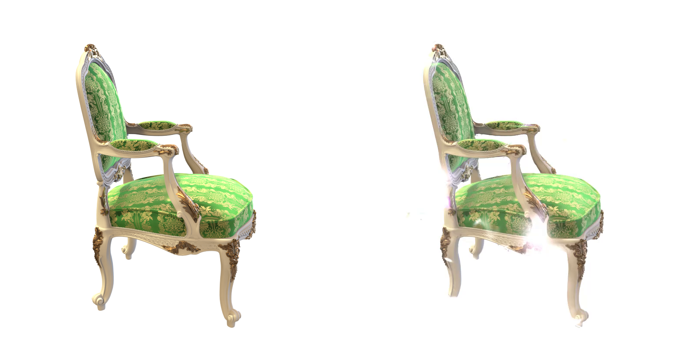

### Worst LPIPS examples

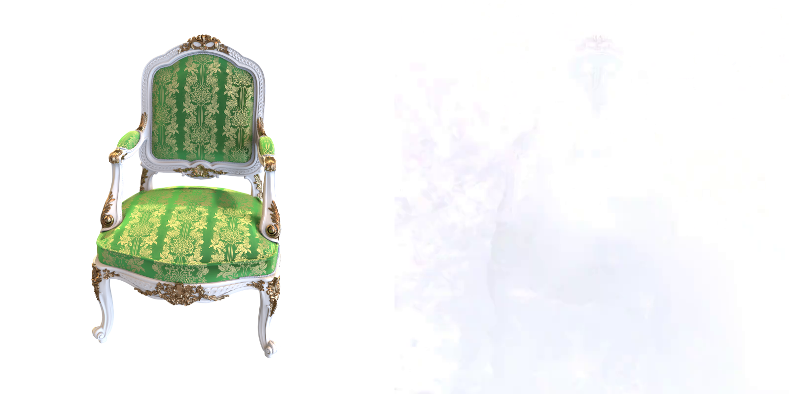

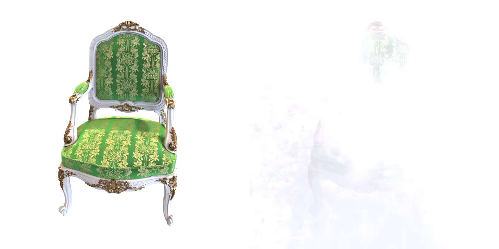

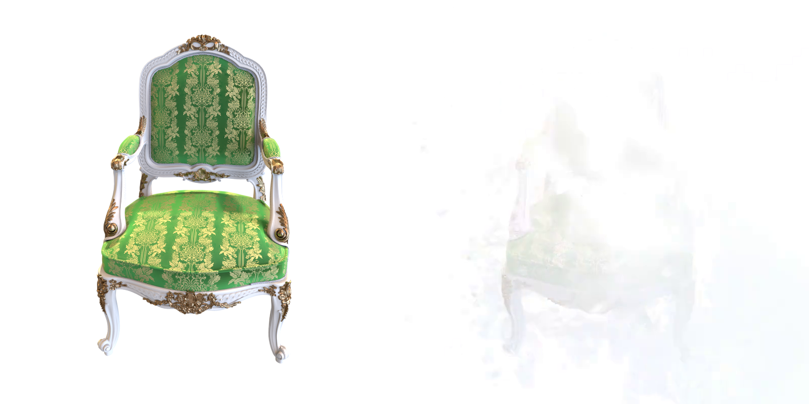

